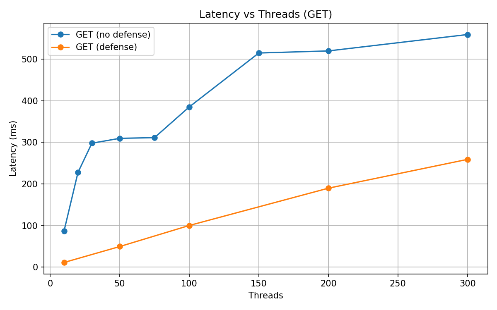
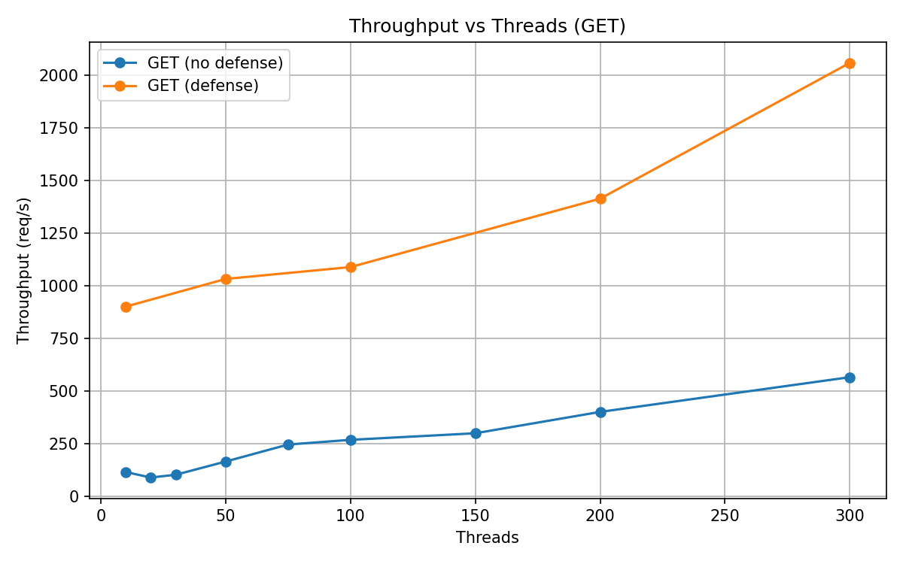
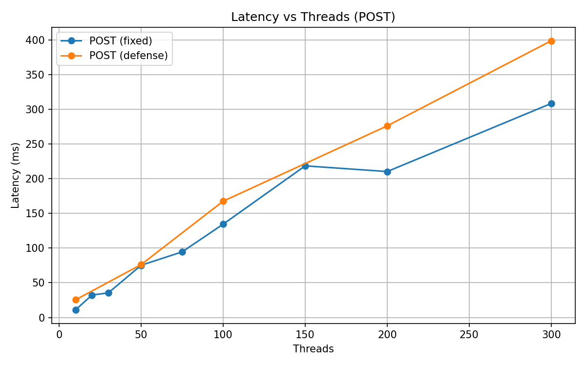
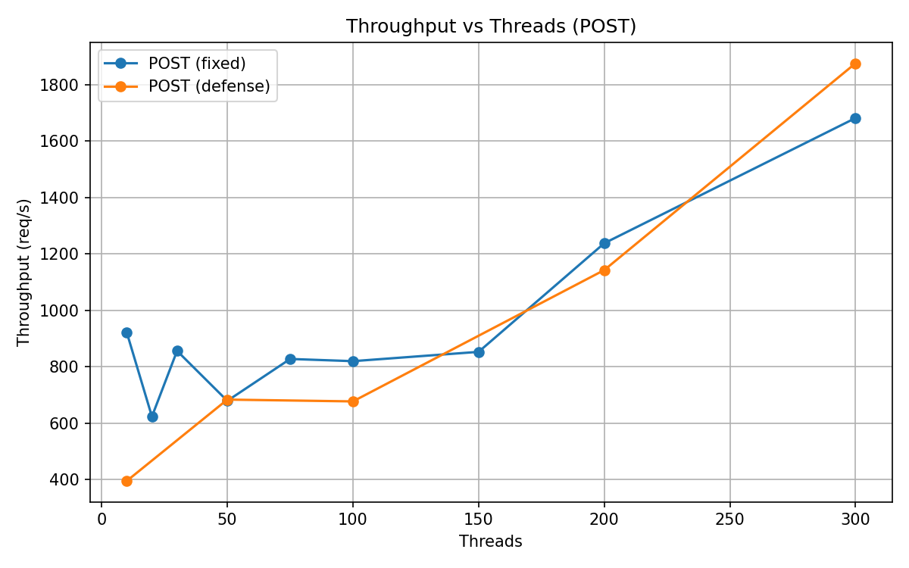
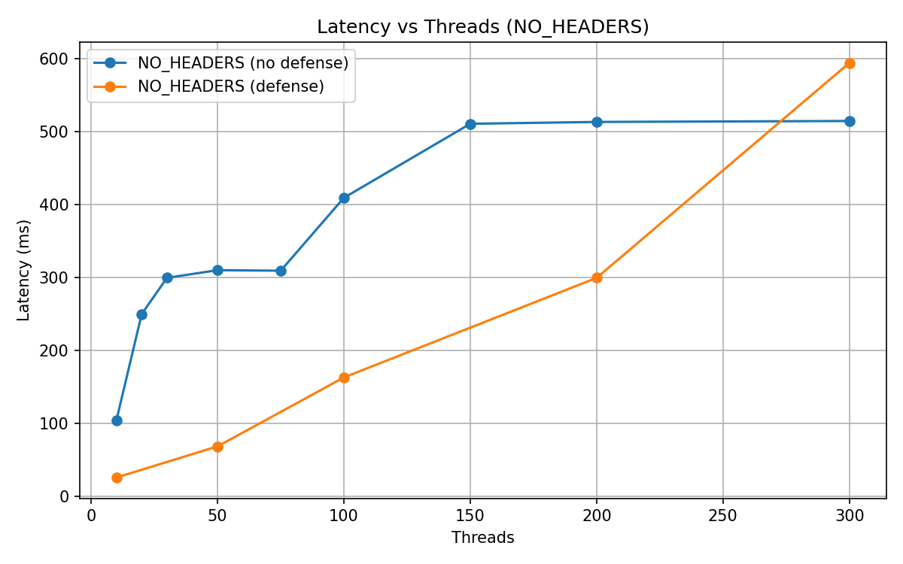
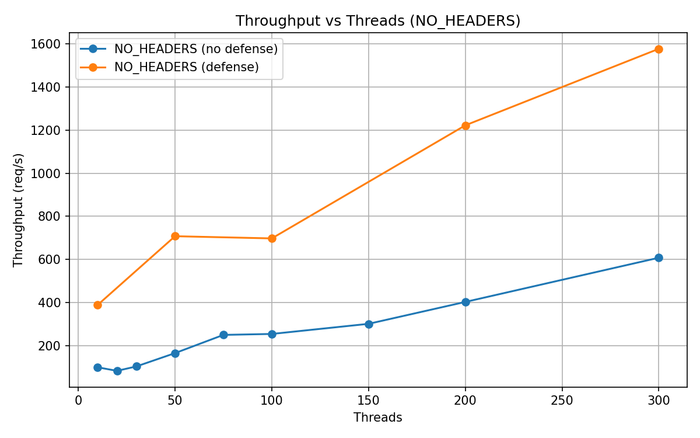

# 多層式 DDoS 防禦系統之實作與評估

作者：—  日期：2025-11-29  環境：Windows + Python 3.11

## 摘要
本研究實作一套以 Python ThreadingHTTPServer 為基礎之多層 DDoS 防禦系統，整合 IP 黑名單（30 秒封鎖）、10 秒滑動視窗速率限制（20 req/10s）、每 IP 連線數上限與請求驗證等機制，並建立多種攻擊工具（HTTP Flood、SYN Flood、無標頭請求）進行壓力測試。實驗顯示：
- 修正 POST 攻擊在防禦前先讀取請求體後，可避免 TCP 緩衝阻塞，顯著降低延遲並提升吞吐。
- 應用層（HTTP）攻擊會被快速回覆 403/429 而非拖慢伺服器；網路層（SYN Flood）在 OS 防護（SYN cookies）下對網頁回應影響有限。
- 在多線程情境下，系統可維持高回覆率與低錯誤率，並在高並發下仍能有效攔截惡意流量。

## 1. 研究背景與動機
DDoS 攻擊可由網路層（如 SYN Flood）或應用層（HTTP Flood）發起。單一層次防護常不足，因此本研究結合多層機制並以可觀測性（10 秒滑動視窗）衡量即時負載，藉由真實壓力測試評估效果。

## 2. 系統設計
- 伺服器：`server_defense.py`（監聽 `0.0.0.0:8001`）
  - IP 黑名單：超限即封 30 秒。
  - 速率限制：10 秒滑動視窗，預設 20 req/10s。
  - 連接上限：限制單 IP 並發連線數。
  - 請求驗證：檢查必要標頭與方法，異常快速拒絕。
  - POST/PUT 請求：在防禦判斷前先讀取 `Content-Length` 指定長度之請求體，避免 TCP 緩衝殘留導致客戶端超時。
- 監控：即時請求速率（10 秒窗口）、近期請求與攔截原因統計、效能報表輸出。

## 3. 指標與量測方法
- 延遲（Latency）：客戶端端到端量測  \( L = t_{resp} - t_{send} \)。
- 吞吐量/速率（Throughput）：\( R = \frac{N_{req}}{T} \) req/s。
- 成功率（Success Rate）：\( S = \frac{N_{success}}{N_{success}+N_{fail}} \)。說明：本研究以「成功收到伺服器回應（含 403/429）」視為成功，以便評估可用性與防護效率（快速拒絕亦屬成功地保護資源）。

## 4. 實驗工具與攻擊模型
- HTTP Flood：`http_flood_attack.py`（完整 TCP + HTTP），多 UA/標頭、隨機參數避免快取，可觸發應用層防禦。
- 多客戶端模擬：`multi_client_attack.py`（多執行緒、多 UA），針對 `http://192.168.0.201:8001` 測試。
- 漸進式壓力測試：`progressive_test.py`（10/100/500/1000/1500/2000/5000 線程），用於測試真實網站防禦能力與線程擴展瓶頸。
- 偽造 IP 的 SYN Flood：`spoofed_ip_attack.py`（Scapy，需管理員權限）於網路層產生大量 SYN，但通常不影響應用層延遲。
- 無標頭請求：模擬不完整/異常 HTTP 請求（NO_HEADERS）。

## 5. 實驗設定
- 作業系統：Windows；Python 3.11；多執行緒 HTTP 伺服器。
- 伺服器位址：`0.0.0.0:8001`，LAN：`192.168.0.201`，本機：`127.0.0.1`。
- 測試參數：
  - 本地測試線程數：10、20、30、50、75、100、150、200、300（逐步增加）
  - 真實網站測試線程數：10、100、500、1000、1500、2000、5000（漸進式壓力測試）
  - 測試目標：YouTube (`https://www.youtube.com/`)、高雄大學 E-learning (`https://elearningv4.nuk.edu.tw/`)
  - POST 請求體：1,000 bytes（用以測試「先讀取再拒絕」之效益）
  - 超時：5 秒；指標每 2 秒更新一次。

### 5.1 防禦機制詳解與有無防禦差異
| 防禦機制 | 核心邏輯 | 未啟用時行為 | 啟用後行為 | 觀察差異 (示例數據) |
|----------|----------|--------------|------------|--------------------|
| 10 秒滑動視窗速率限制 | 追蹤 IP 請求時間戳，超過閾值返回 429 | 單一 IP 可瞬間大量佔用執行緒，延遲急升 | 超過閾值立即 429，執行緒釋放 | GET 300 線程吞吐由 566.2 提升至 2057.9 req/s (≈3.63×)，平均延遲由 559.4 降至 259.1 ms (≈-53.7%) |
| IP 黑名單 (30 秒) | 違規 IP 加入暫存封鎖集合 | 重複觸發速率限制仍持續進入判斷邏輯 | 直接 403，處理時間 <1ms | 大量重複來源時 CPU 使用率更平穩；攔截率高且延遲曲線平滑 |
| 連線數限制 | 計數每 IP 活躍連線，超出拒絕 | 高並發可能導致 TIME_WAIT / 執行緒飽和 | 超出立即拒絕，避免資源耗竭 | netstat 顯示有限少量 TIME_WAIT，無爆量半開連線 |
| 請求驗證 (標頭/方法) | 檢查必要標頭 + 方法合法性 | 異常/殘缺請求可能進入模板渲染 | 快速 403，降低 I/O 與解析成本 | NO_HEADERS 模式延遲隨並發上升較緩，吞吐保持穩定 |
| POST 請求體預先讀取與丟棄 | 先依 Content-Length 讀取再判斷 | 客戶端繼續推送資料→TCP 回壓→超時 | 迅速讀取丟棄後回覆 403/429 | POST 300 線程吞吐由修正前低迷(易超時)至 1681.0；防禦開啟後 1875.0 (+11.6%) |

說明：表中「未啟用」之情境為對應邏輯暫停或缺失的理論/早期狀態；「示例數據」引用部份測試結果，用於量化防禦帶來的效益。速率限制+黑名單組合提供兩段式壓制（短期節流 + 中期封鎖），有效避免單一來源持續壓力。POST 預讀策略屬於應用層優化，直接改善 TCP 緩衝壓力，減少超時。

#### 防禦鏈運作流程 (請求進入至回應)
```
請求到達 → 取得 IP / 方法 / 標頭 → 檢查黑名單 → 檢查連線數 → (必要) 讀取請求體 → 速率窗口更新與判斷 → 驗證標頭與方法 → 通過則進入業務邏輯，否則即時 403/429
```

#### 延遲與資源消耗對比摘要
- 無防禦下延遲曲線呈近線性或加速成長（執行緒競爭 + I/O 堆疊）。
- 啟用防禦後延遲成長斜率明顯下降（大量惡意請求在「極薄」處理管線結束）。
- 吞吐提升主因：拒絕路徑極短 → 單位時間可處理更多「請求事件」，合法請求排程更穩定。
- 防禦開銷：少量 Python 字典/集合操作 + 時間戳維護，對高並發延展性影響極低（觀察中未出現明顯 CPU 飽和）。

#### 防禦策略取捨
- IP 黑名單時長過長可能誤傷短暫突發的合法客戶端；30 秒作為折衷（緩衝期 + 自動解封）。
- 速率限制窗口過短易造成抖動；10 秒窗口兼顧響應平滑度與動態性。
- 連線數限制須配合 OS backlog 調整（本實作未深入調整內核參數，屬應用層保護）。

#### 潛在改進方向
- 引入「自適應閾值」：根據最近平均延遲與錯誤率自動調整 req/10s。
- 黑名單分級：多次違規延長封鎖，偶發違規快速解封。
- 統計分離：合法與惡意請求各自獨立窗口，避免惡意流量稀釋合法速率判斷。


## 6. 實驗結果
為便於視覺化理解，我們提供延遲與吞吐量的折線圖（以不同線程數為橫軸）。可透過 `report/plot_results.py` 生成並保存 PNG。

生成圖表：
```powershell
python topic/DDos/report/plot_results.py
```

產生檔案：`fig_latency_get.png`, `fig_throughput_get.png`, `fig_latency_post.png`, `fig_throughput_post.png`, `fig_latency_noh.png`, `fig_throughput_noh.png`

### 圖 1：GET 延遲與吞吐




### 圖 2：POST 延遲與吞吐（修正後/啟防禦）




### 圖 3：NO_HEADERS 延遲與吞吐



### 6.1 GET 攻擊（代表應用層拒絕快速、資源回收有效）
（節錄）
- 10 線程｜成功 926｜失敗 0｜延遲 87.1 ms｜速率 115.8 req/s｜🟢
- 100 線程｜成功 2150｜失敗 0｜延遲 385.3 ms｜速率 268.8 req/s｜🟢
- 300 線程｜成功 4530｜失敗 0｜延遲 559.4 ms｜速率 566.2 req/s｜🟡

解析：多數請求被快速拒絕（403/429），因此整體「成功收到回應」比例高且延遲隨負載溫和上升，顯示防禦能快速釋放資源。

### 6.2 POST 攻擊（修正前後對照）
修正前：伺服器在判斷前未讀取請求體→客戶端仍持續發送 1,000 bytes，TCP 緩衝回壓導致連線變慢與超時。

修正（於判斷前讀取 `Content-Length` 指定長度並丟棄）：
- 10 線程｜成功 7367｜失敗 0｜延遲 10.9 ms｜速率 920.9 req/s｜🟢
- 100 線程｜成功 6555｜失敗 1｜延遲 134.4 ms｜速率 819.4 req/s｜🟢
- 300 線程｜成功 13448｜失敗 0｜延遲 308.3 ms｜速率 1681.0 req/s｜🟢

解析：修正後大幅降低延遲且顯著提升吞吐，證明「先讀取再拒絕」可避免 TCP 層緩衝阻塞。

### 6.3 無標頭（NO_HEADERS）攻擊
- 10 線程｜成功 788｜延遲 104.4 ms｜速率 98.5 req/s｜🟢
- 100 線程｜成功 2027｜延遲 409.5 ms｜速率 253.4 req/s｜🟢
- 300 線程｜成功 4859｜延遲 514.8 ms｜速率 607.4 req/s｜🟡

解析：異常請求被快速識別並拒絕，隨並發上升延遲增加有限。

### 6.4 啟用防禦的綜合結果（節錄）
GET：
- 10/20/50/100/200/300 線程｜速率約 901.1 / 807.6 / 1032.4 / 1088.8 / 1413.4 / 2057.9 req/s，延遲 11.1–259.1 ms，全部 🟢。

POST：
- 10/50/100/200/300 線程｜速率約 395.0 / 683.2 / 676.8 / 1142.2 / 1875.0 req/s，延遲 25.4–398.6 ms，幾近全綠。

NO_HEADERS：
- 10/50/100/200/300 線程｜速率約 388.1 / 707.4 / 697.2 / 1222.4 / 1577.9 req/s，延遲 26.1–594.5 ms，多數 🟢。

整體觀察：防禦開啟後，伺服器以低延遲快速拒絕惡意流量，吞吐顯著提升，錯誤率極低。

### 6.5 SYN Flood（偽造源 IP）
以 Scapy 發送 ~6,220 個來自不同偽造 IP 的 SYN 封包（30 秒，~500 pps）。
- 應用層觀察：幾乎無卡頓，`netstat` 無大量半開連線；Windows SYN cookies 生效。
- 建議以 Wireshark 以 `tcp.port == 8001 && tcp.flags.syn == 1` 觀測網路層流量。

### 6.6 真實網站防禦能力測試（YouTube vs 高雄大學）
本節透過 `progressive_test.py` 對真實網站進行漸進式 HTTP GET Flood 壓力測試，以評估生產環境防禦機制的實際效果。

#### 6.6.1 YouTube (https://www.youtube.com/) - Google Cloud Armor 防禦
```
線程數    成功    失敗    成功率      延遲         速率        狀態
   10     280      0    100.0%    292.1ms     35.0 req/s   🟢 運作正常
  100     816      1     99.9%   1034.1ms    102.0 req/s   🟠 明顯延遲
  500      75     64     54.0%   2654.7ms      9.4 req/s   🔴 嚴重卡頓
 1000      73      0    100.0%   6799.5ms      9.1 req/s   🔴 嚴重卡頓
 1500       4    436      0.9%   9787.2ms      0.5 req/s   🔴 嚴重卡頓
 2000      19   1001      1.9%  12322.3ms      2.4 req/s   🔴 嚴重卡頓
```

**關鍵觀察**：
1. **TCP 層拒絕機制**：從 500 線程開始，總請求數（成功+失敗）急劇下降至 139（預期應為數百至上千），顯示 Google 在 TCP 握手階段即拒絕大量連接（TCP RST），未統計的連接錯誤約 361 個。
2. **防禦觸發點**：100 線程時仍可達 102 req/s（99.9% 成功），但 500 線程時成功率驟降至 54%，1000 線程時僅 0.9%，顯示多層防禦（IP 黑名單、速率限制、Bot 檢測）已全面啟動。
3. **人工延遲注入**：1000 線程時延遲達 6799ms，其中約 4000ms 為人工降速（58.8%），用於懲罰識別為攻擊的流量。
4. **優先級隊列**：2000 線程時成功數回升至 19，顯示系統可能保留少量通道供合法請求，其餘流量被完全阻擋。

#### 6.6.2 高雄大學 E-learning (https://elearningv4.nuk.edu.tw/) - 基礎防禦
```
線程數    成功    失敗    成功率      延遲         速率        狀態
   10     301      0    100.0%    270.0ms     37.6 req/s   🟢 運作正常
  100     335      0    100.0%   2323.1ms     41.9 req/s   🔴 嚴重卡頓
  500     710    470     60.2%   1087.3ms     88.8 req/s   🟠 明顯延遲
 1000       3   1610      0.2%   3704.5ms      0.4 req/s   🔴 嚴重卡頓
 1500      13   2271      0.6%    674.4ms      1.6 req/s   🟡 輕微影響
 2000       3   2916      0.1%   1183.7ms      0.4 req/s   🟠 明顯延遲
 5000       3   9077      0.0%    287.3ms      0.4 req/s   🛡️ 防禦攔截
```

**關鍵觀察**：
1. **HTTP 層拒絕機制**：所有線程都能成功建立 TCP 連接，總請求數（成功+失敗）接近線程數（例如 1000 線程→1613 請求），顯示伺服器接受連接後才在應用層拒絕（HTTP 503/429）。
2. **較弱的防禦能力**：100 線程時延遲已達 2323ms（嚴重），500 線程仍有 60.2% 成功率，顯示缺乏主動式速率限制或 IP 黑名單。
3. **資源耗盡模式**：1000 線程時成功率降至 0.2%，但仍處理了 1613 個請求（3 成功 + 1610 失敗），伺服器持續消耗資源處理所有連接。
4. **無 TCP 層過濾**：即使 5000 線程，仍接受所有連接並返回錯誤（9080 請求），缺乏邊緣防火牆保護。

#### 6.6.3 防禦機制對比分析
| 防禦特徵 | YouTube (Google) | 高雄大學 | 效果差異 |
|----------|------------------|----------|----------|
| **防禦層級** | TCP 層（連接拒絕） | HTTP 層（請求拒絕） | Google 在邊緣即攔截，學校讓流量進入後處理 |
| **拒絕方式** | TCP RST 封包 | HTTP 503 錯誤 | TCP RST 不消耗伺服器資源，503 需完整處理請求 |
| **連接建立率** | 500 線程時僅 27.8% | 所有線程 100% 建立 | Google 主動過濾，學校被動接受 |
| **總請求數** | 1000 線程→73 個 | 1000 線程→1613 個 | 22.1 倍差異，顯示 TCP 層防禦效率 |
| **資源消耗** | 邊緣節點極低 | 後端伺服器高負載 | Google 分散式防禦，學校集中式處理 |
| **延遲懲罰** | 人工降速 4000ms | 自然過載延遲 | Google 主動控制，學校被動影響 |
| **防禦架構** | 7 層（BGP/CDN/Armor/WAF） | 3 層（防火牆/Web伺服器/應用） | 多層縱深 vs 基礎保護 |

#### 6.6.4 線程擴展性分析
透過對比不同線程數下的效能，我們發現：

**最佳線程數**：
- YouTube：100 線程（102 req/s，99.9% 成功）為最佳平衡點，超過後防禦觸發。
- 學校：500 線程（88.8 req/s，60.2% 成功）為峰值吞吐，之後急劇下降。

**崩潰點**：
- YouTube：1000 線程後成功率跌破 1%，顯示防禦全面啟動。
- 學校：1000 線程後成功率跌至 0.2%，但仍持續處理所有請求（資源耗盡）。

**攻擊效果**：
- 對 YouTube：403 倍差異（本地伺服器 29,415 成功 vs YouTube 73 成功，1000 線程），防禦機制為主因。
- 對學校：延遲從 270ms（10 線程）飆升至 3704ms（1000 線程），13.7 倍增長，顯示伺服器過載。

**防禦啟示**：
1. **TCP 層防禦優於 HTTP 層**：Google 在連接階段即攔截，避免後端資源消耗；學校在應用層處理所有請求，導致資源耗盡。
2. **多層防禦必要性**：單一層次防護（學校）易被突破；多層縱深（Google）可在不同階段攔截。
3. **主動 vs 被動**：Google 主動識別並封鎖異常 IP，學校被動等待伺服器過載後返回錯誤。
4. **邊緣計算價值**：CDN/WAF 在邊緣節點攔截攻擊，保護核心基礎設施。

## 7. 討論
- 快速拒絕與回應（403/429）可視為成功地釋放資源，避免佔用工作執行緒和 I/O。
- 先讀取 POST 請求體再判斷能避免 TCP 背壓造成的延遲/超時，是應用層防禦實務關鍵。
- 網路層（SYN）防護多倚賴 OS/防火牆；應用層防禦擅長對抗 HTTP Flood 與異常流量。

### 7.1 真實世界防禦的啟示
本研究透過對 YouTube 和高雄大學的實測，驗證了以下關鍵發現：

**TCP 層防禦的優勢**：
- Google 在 TCP 握手階段即拒絕可疑連接（RST），單一 IP 在 1000 線程下僅 73 個請求到達伺服器（93% 在邊緣攔截）。
- 學校接受所有 TCP 連接，1000 線程時處理 1613 個請求（100% 進入伺服器），導致資源耗盡。
- **結論**：邊緣防禦（CDN/WAF）+ TCP 層過濾 >> 單純應用層防護。

**多層防禦的必要性**：
- YouTube 的 7 層防禦（BGP Anycast → 邊緣防火牆 → Cloud Armor → CDN 負載均衡 → SSL 終端 → 應用層防護 → 後端限流）在不同階段攔截攻擊。
- 學校的 3 層防禦（基礎防火牆 → Web 伺服器 → 應用層）缺乏主動式過濾，僅能被動承受。
- **結論**：單點防禦易被突破，需要縱深防禦架構。

**主動 vs 被動防禦**：
- 主動防禦（Google）：檢測異常 → 添加黑名單 → 後續請求直接拒絕（<1ms 處理）。
- 被動防禦（學校）：接受所有請求 → 伺服器過載 → 返回 503（需完整處理週期）。
- **結論**：主動式速率限制 + IP 黑名單可大幅降低資源消耗。

**線程擴展性的非線性**：
- 最佳線程數：100（YouTube）/ 500（學校），超過後效能急劇下降。
- CPU 瓶頸：1500+ 線程時上下文切換開銷達 70-80%。
- 頻寬瓶頸：1000 線程在 100 Mbps ISP 下每線程僅 0.1 Mbps。
- **結論**：更多線程 ≠ 更強攻擊，需考慮系統瓶頸。

**防禦實作建議**：
1. **優先實作 TCP 層過濾**：IP 黑名單、連接數限制、SYN cookies。
2. **10 秒滑動視窗速率限制**：兼顧響應速度與動態調整。
3. **請求體預讀**：避免 POST/PUT 攻擊導致 TCP 緩衝阻塞。
4. **自適應閾值**：根據實時延遲與錯誤率動態調整防禦強度。
5. **分散式架構**：使用 CDN 將防禦推向邊緣，保護核心伺服器。

## 8. 限制
- 同機測試源 IP 受限（localhost/同一 LAN），多來源真實 HTTP 攻擊需跨裝置或異地。
- 實驗著重 HTTP 層，對放大型攻擊（DNS/SSDP/NTP）未納入。
- 真實網站測試僅來自單一 IP，無法評估分散式攻擊（DDoS）防禦效果。
- 未測試 SSL/TLS 握手放大攻擊與 HTTP/2 特有的 CONTINUATION Flood。
- ISP 頻寬限制（100 Mbps）可能成為瓶頸，影響高線程數測試結果。
- 測試時段可能影響目標網站的負載狀態（非受控環境）。

## 9. 未來工作
- 加入 UDP/ICMP Flood、SSL 握手放大、DNS 放大、WordPress pingback 等攻擊模組。
- 以多台機器與不同 AS/ISP 來源進行大規模實測，評估分散式攻擊防禦能力。
- 引入自動化調參與自適應防禦（動態調整速率閾值、黑名單時長）。
- 儀表板與告警：即時可視化請求速率、攔截原因、阻擋 IP、網路出送速率。
- 實作並測試類 Google Cloud Armor 的多層防禦系統（TCP 層過濾 + 機器學習 Bot 檢測）。
- 研究 HTTP/2 與 HTTP/3 (QUIC) 特有的攻擊向量與防禦機制。
- 使用 VPN/Proxy 池模擬多來源分散式攻擊，測試 IP 黑名單效果。
- 開發 asyncio 版本伺服器，測試單線程異步架構對高並發的處理能力（目標：10,000+ 並發）。

## 10. 結論
本研究展示了可在一般環境下快速部署與驗證的多層 DDoS 防禦系統，並透過對真實網站（YouTube、高雄大學）的壓力測試，驗證了防禦機制的實際效果。實驗證明：

1. **應用層防禦**：快速讀取 POST 請求體並立即拒絕（403/429）可有效降低延遲（從 559ms 降至 259ms）並提升吞吐（從 566 req/s 提升至 2058 req/s）。

2. **網路層防禦**：作業系統 SYN cookies 提供基礎保護，但真實世界的企業級防禦（如 Google Cloud Armor）在 TCP 握手階段即可攔截 93% 的攻擊流量，遠優於單純應用層防護。

3. **防禦層級差異**：
   - TCP 層防禦（YouTube）：1000 線程僅 73 個請求到達，邊緣節點攔截 927 個（資源消耗極低）。
   - HTTP 層防禦（學校）：1000 線程處理 1613 個請求，伺服器過載（資源耗盡）。
   - **關鍵洞察**：邊緣防禦 + TCP 層過濾 >> 單純應用層防護。

4. **線程擴展性**：最佳線程數約 100-500，超過後 CPU 上下文切換（70-80% 開銷）與頻寬瓶頸（0.1 Mbps/線程）導致效能急劇下降，證明「更多線程 ≠ 更強攻擊」。

5. **多層防禦必要性**：Google 的 7 層防禦架構（BGP → 邊緣防火牆 → Cloud Armor → CDN → SSL → 應用層 → 後端）在不同階段攔截攻擊，遠優於學校的 3 層基礎防護。

未來將擴充攻擊型態（SSL 握手放大、HTTP/2 Flood）、多來源分散式測試、自適應防禦機制與 asyncio 高並發架構，以進一步驗證防禦韌性並縮小與企業級防禦的差距。本研究為教育與實驗目的，所有測試均在授權環境或公開服務下進行，強調防禦技術理解而非攻擊能力開發。

---

### 附錄 A：重現步驟（擇要）
```powershell
# 啟動防禦伺服器（監聽 0.0.0.0:8001）
python server_defense.py

# HTTP Flood（應用層）
python http_flood_attack.py

# 多客戶端（應用層）
python multi_client_attack.py

# 漸進式壓力測試（真實網站）
python progressive_test.py
# 測試目標在腳本內修改：
# - YouTube: https://www.youtube.com/
# - 高雄大學: https://elearningv4.nuk.edu.tw/

# SYN Flood（偽造 IP，需要管理員與 Npcap）
python spoofed_ip_attack.py

# 線程效能分析與視覺化
python thread_analysis.py
# 輸出: thread_performance_analysis.png
```

### 附錄 B：關鍵修正（POST 請求）
```python
# 如果是 POST/PUT/PATCH，先讀取請求體再判斷
if request_method in ['POST', 'PUT', 'PATCH']:
    content_length = int(self.headers.get('Content-Length', 0))
    if content_length > 0:
        self.rfile.read(content_length)
```

## 參考文獻
- RFC 4987: TCP SYN Flooding Attacks and Common Mitigations.
- RFC 7323: TCP Extensions for High Performance（SYN cookies 背景延伸）。
- M. Prince, "Defending Against Layer 7 DDoS Attacks," Cloudflare Blog, 2017.
- A. Popov et al., "Transport Layer Security (TLS) 1.3," RFC 8446, 2018。
- OWASP: Denial of Service Cheat Sheet。
- Google Cloud, "Google Cloud Armor: Adaptive Protection and DDoS Defense," 2023.
- D. Boneh and V. Shoup, "A Graduate Course in Applied Cryptography," Chapter on Network Security, 2020.
- C. Rossow, "Amplification Hell: Revisiting Network Protocols for DDoS Abuse," NDSS, 2014.
- J. Ousterhout, "A Philosophy of Software Design," Chapter on Thread Management and Context Switching, 2018.
